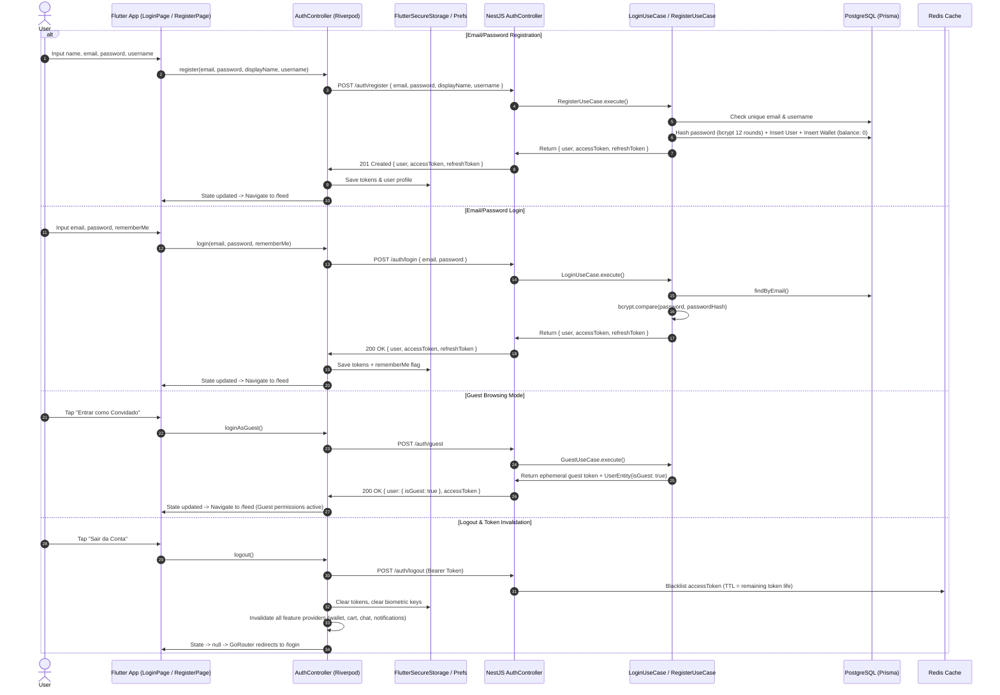
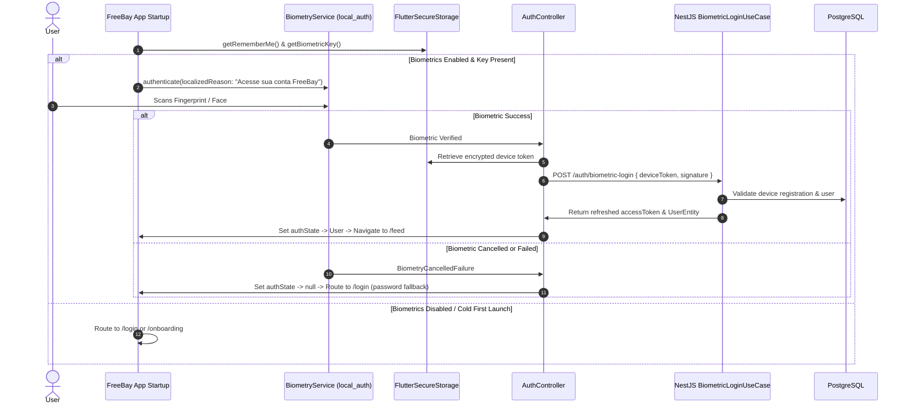
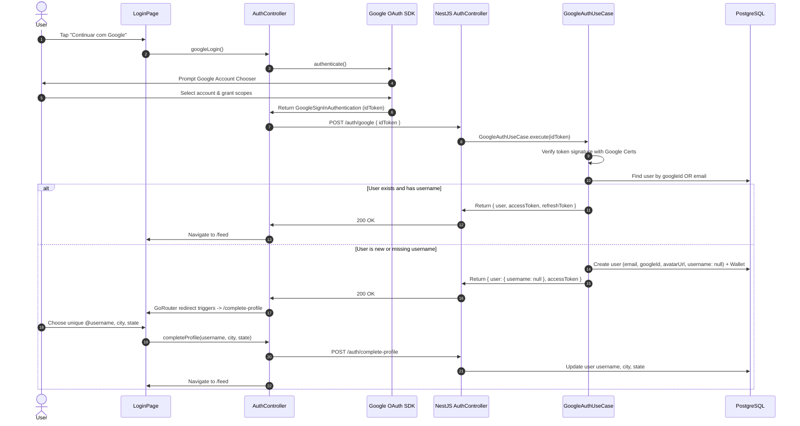
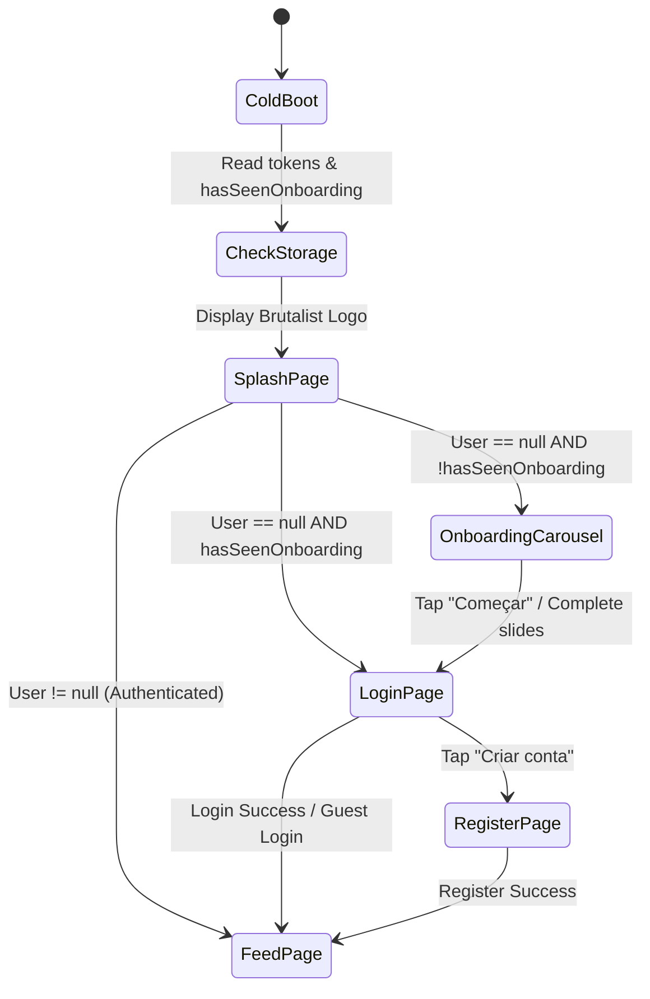
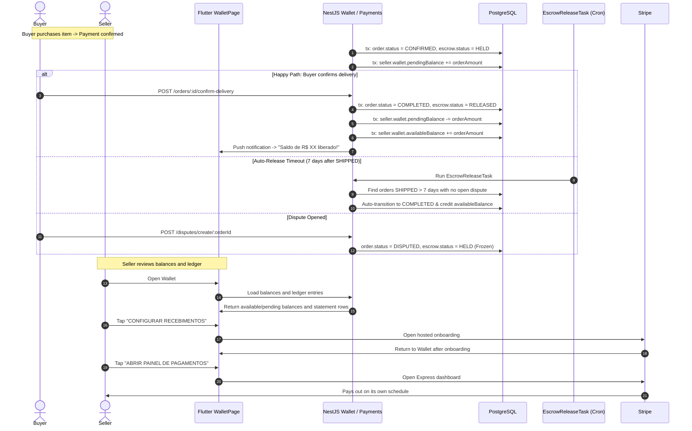
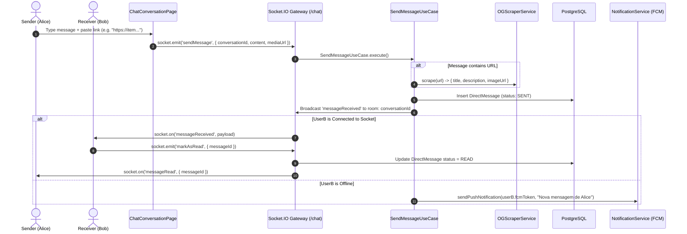
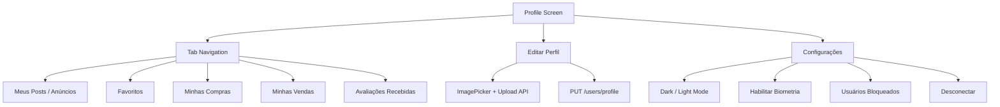
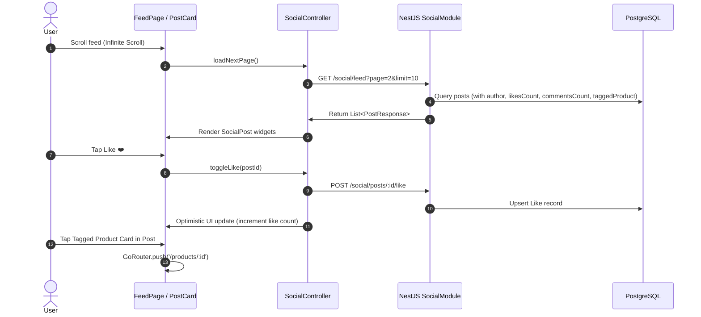
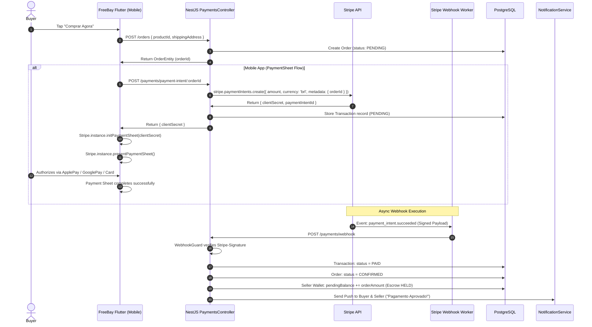
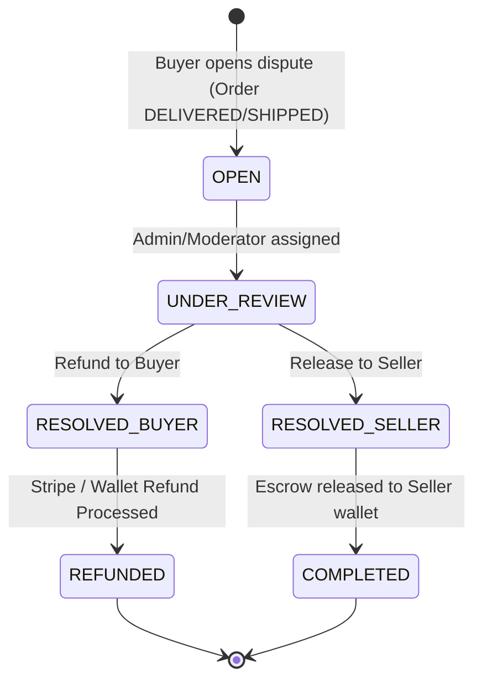

# FreeBay End-to-End Application Flows & State Architecture

This skill documents every user journey, UI state machine, API interaction, database transaction, and edge case across the FreeBay C2C marketplace platform.

---

## 1. Authentication & Session Lifecycle Flow

### 1.1 Overview & State Hierarchy
- **Frontend State**: `authControllerProvider` (`AsyncValue<UserEntity?>`), `isInitialAuthLoadingProvider` (`bool`), `hasSeenOnboardingProvider` (`bool`).
- **Storage**: `StorageService` (`FlutterSecureStorage` for JWT tokens & refresh token, `SharedPreferences` for `rememberMe` and `hasSeenOnboarding`).
- **Backend**: `AuthModule` -> `RegisterUseCase`, `LoginUseCase`, `GuestUseCase`, `GoogleAuthUseCase`, `BiometricLoginUseCase`, `ResetPasswordUseCase`.
- **Session Protection**: Redis token blacklist on logout, JWT verification via Passport `JwtStrategy`, global rate-limiting (`ThrottlerGuard`).

### 1.2 Auth Sequence Diagram

### 1.3 Edge Cases & Error Handling
- **Duplicate Email/Username**: Returns `EmailAlreadyExistsError` / `UsernameAlreadyTakenError` -> Controller renders localized `BrutalistErrorBanner`.
- **Account Locked / Invalid Credentials**: Returns `InvalidCredentialsError` (HTTP 401) with standard error envelope `{ success: false, error: { code: 'INVALID_CREDENTIALS', message: '...' } }`.
- **Expired Token**: HTTP 401 triggers Dio interceptor to attempt refresh token rotation; if refresh fails, triggers `forceLogout()` redirecting to `/login`.

---

## 2. Biometry Flow (Fingerprint / Face ID)

### 2.1 Overview
- **Service**: `BiometryService` wraps `local_auth` package.
- **Security**: Device-bound challenge token stored securely.
- **Workflow**:
  1. App cold boot checks `StorageService.getRememberMe()`.
  2. If rememberMe is true but access token is missing/expired, check `BiometryService.isEnabled()`.
  3. Prompt native biometric dialog with custom copy ("Autentique-se para acessar o FreeBay").
  4. On success, exchange stored biometric signature token with NestJS backend `BiometricLoginUseCase`.
  5. On failure/cancellation, fallback cleanly to `LoginPage` without losing saved email.

### 2.2 Biometry Sequence Diagram

---

## 3. Login with Google (OAuth2 / ID Token)

### 3.1 Overview
- **Frontend**: `google_sign_in` plugin initializes native Google Auth sheet.
- **Backend**: `GoogleAuthUseCase` validates the received Google ID Token cryptographically using Google OAuth2 client libraries.
- **Account Linking**: If email already exists, link Google ID to the existing account. If new user, create user record and redirect user to `/complete-profile` if handle/username is required.

### 3.2 Google Sign-In Sequence Diagram

---

## 4. Onboarding & First-Launch Flow

### 4.1 Overview
- First-time users see a high-impact Digital Brutalist onboarding carousel explaining Escrow protection, C2C discovery, and social feeds.
- Once completed or skipped, `StorageService.setHasSeenOnboarding(true)` is saved.
- `hasSeenOnboardingProvider` is hydrated synchronously during cold boot so GoRouter evaluates redirects with zero UI flicker.

### 4.2 Onboarding Navigation State Machine

---

## 5. Wallet, Balance & Financial Escrow Flow

### 5.1 Financial Ledger Architecture
- **Currencies**: All monetary values stored in **Cents (`Int`)** (e.g. `1000` = R$ 10,00).
- **Balances**:
  - `availableBalance` (Int): Available balance shown in the wallet.
  - `pendingBalance` (Int): Held in escrow for active sales until buyer confirms delivery.
- **Ledger**: Statement rows show the financial reason for each balance movement.

### 5.2 Wallet & Escrow Sequence Diagram

---

## 6. Real-Time Chat & Messaging Flow

### 6.1 Architecture Overview
- **Gateway**: Socket.IO NestJS WebSocket Gateway at `/chat`.
- **Dual Model**:
  - **Direct Messages**: 1-on-1 user conversations (`DirectConversation`, `DirectMessage`).
  - **Order Chat**: Contextual chat attached to specific `Order` (`ChatMessage`).
- **Features**: Real-time delivery, typing indicators, read receipts, emoji reactions, link preview (OpenGraph metadata scraper), file/image attachments.

### 6.2 Chat Sequence Diagram

---

## 7. Profile, Social Graph & User Settings Flow

### 7.1 Overview
- **Capabilities**: View own/other profiles, edit bio/display name/city, follow/unfollow, block/unblock users, aggregate seller reviews/ratings.
- **Privacy & Safety**: Blocked users cannot send DMs, see posts in feed, or purchase products.

### 7.2 Profile State Flow

---

## 8. Explore, Discovery & Social Feed Flow

### 8.1 Feed Architecture
- **Feeds**:
  - `FeedPage`: Following feed + curated community posts, stories tray at the top.
  - `ExplorarPage`: Product catalog, category filter chips, search query, location radius.
  - `StoryTray`: Ephemeral 24h stories with auto-cleanup task on NestJS backend.
- **Post Structure**: Media carousel, Markdown text, Product Tagging (`productId` linked directly to a buyable marketplace item), Like button, Comment tree sheet, Share button, Bookmark button.

### 8.2 Feed Interaction Flow

---

## 9. Order, Checkout & Stripe Payment Flow

### 9.1 Platform Specific Checkout
- **Mobile (Android / iOS)**: Uses Stripe **PaymentSheet** (`POST /payments/payment-intent/:orderId` -> `initPaymentSheet` -> `presentPaymentSheet`).
- **Web / Multi-item Cart**: Uses Stripe **Checkout Session** (`POST /payments/checkout/:orderId` -> Web Checkout URL with PIX / Card).
- **Webhooks**: Stripe webhook listener (`/payments/webhook`) verified with `WebhookGuard` signature check and idempotency deduplication (`WebhookDedupeInterceptor`).

### 9.2 Complete Payment Sequence Diagram

---

## 10. Dispute Resolution Flow

### 10.1 Dispute Lifecycle

### 10.2 Dispute Rules & Safety
- Either party can submit evidence messages and photos.
- While a dispute is `OPEN` or `UNDER_REVIEW`, escrow funds are **strictly locked**; `EscrowReleaseTask` ignores disputed orders.
- Resolving with `REFUND` cancels the order and reverses the seller's `pendingBalance`.

---

## 11. Notification System Architecture

### 11.1 Notification Channels
1. **Push Notifications**: Firebase Cloud Messaging (FCM) triggered via `NotificationService` for background/killed app events.
2. **In-App Badges & Socket Events**: Instant UI updates for active sessions.
3. **Database Records**: `Notification` model storing notification history, category (`ORDER`, `CHAT`, `SOCIAL`, `PAYMENT`, `SYSTEM`), and read state.

---

## 12. Complete Route & Navigation Matrix

| Path | Screen / Page | Auth Guard | Notes |
|---|---|---|---|
| `/splash` | `SplashPage` | Public | Boot & session check |
| `/onboarding` | `OnboardingPage` | Public | Shown on first launch |
| `/login` | `LoginPage` | Public | Email/pwd, Google, Biometric |
| `/register` | `RegisterPage` | Public | Create new account |
| `/recover-password` | `RecoverPasswordPage` | Public | Send recovery OTP |
| `/reset-password` | `ResetPasswordPage` | Public | Set new password |
| `/complete-profile` | `CompleteProfilePage` | Auth Required | Google Sign-in handle setup |
| `/feed` | `FeedPage` (Tab 0) | Public/Guest OK | Social posts & stories |
| `/explore` | `ExplorarPage` (Tab 1) | Public/Guest OK | Product discovery & search |
| `/wallet` | `WalletPage` (Tab 2) | Auth Required | Balances, ledger & Stripe payouts |
| `/chat` | `ChatListPage` (Tab 3) | Auth Required | DMs & Order chats |
| `/profile` | `ProfilePage` (Tab 4) | Public/Guest OK | User profile & listings |
| `/checkout` | `CheckoutPage` | Non-Guest Only | Order placement & payment |
| `/disputes` | `DisputeListPage` | Non-Guest Only | Dispute management |
| `/products/create` | `CreateProductPage` | Non-Guest Only | Sell item |
| `/create-post` | `CreatePostPage` | Non-Guest Only | Share social post |

---
