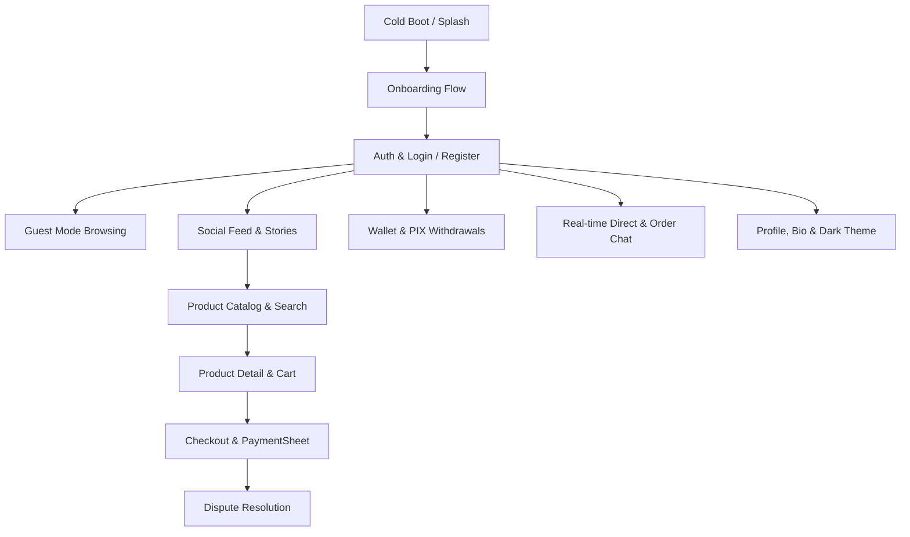

# FreeBay Mobile MCP Automation & Testing Skill

This skill defines the standard procedures for running end-to-end and exploratory mobile verification on FreeBay using `mobile-mcp` tools across physical devices, emulators, and cloud runners.

---

## 📱 Mobile MCP Tool Reference

| Tool Name | Purpose in FreeBay Testing |
|---|---|
| `mobile_list_available_devices` | Discover connected Android/iOS devices and active emulators. |
| `mobile_launch_app` | Launch FreeBay (`com.example.freebay` / bundle id). |
| `mobile_terminate_app` | Kill app process for cold boot testing. |
| `mobile_list_elements_on_screen` | Inspect accessibility tree, widget IDs, text labels, and bounding boxes. |
| `mobile_click_on_screen_at_coordinates` | Tap buttons, inputs, tabs, and interactive brutalist cards. |
| `mobile_double_tap_on_screen` | Quick double tap (e.g. like social post). |
| `mobile_long_press_on_screen_at_coordinates` | Context menu, message reactions, long press actions. |
| `mobile_type_keys` | Fill forms (email, password, OTP, chat input, search bar). |
| `mobile_swipe_on_screen` | Infinite scroll on feed/catalog, carousel paging, pull-to-refresh. |
| `mobile_press_button` | Send system keys (BACK, HOME, ENTER). |
| `mobile_take_screenshot` | Capture screen state for visual regression verification. |
| `mobile_list_crashes` / `mobile_get_crash` | Diagnose unexpected app exits and exceptions. |

---

## 🔄 Core FreeBay Mobile Test Matrix

Verify all 12 key user journeys defined in `freebay-app-flows`:



### 1. Auth & Session Flow
- **Email/Password Login**: Click email input -> type -> click password -> type -> click "Entrar" -> verify transition to `/feed`.
- **Guest Browsing**: Tap "Entrar como Convidado" -> verify guest banner / restricted actions.
- **Biometric Prompt**: Authenticate or verify fallback on cancellation.
- **Logout**: Settings -> tap "Sair da Conta" -> verify redirect to `/login`.

### 2. Feed & Stories Flow
- **Story Tray**: Inspect top stories -> tap avatar -> verify story viewer opens -> tap or swipe to dismiss.
- **Feed Scroll**: Swipe up -> verify lazy loading / infinite pagination -> tap Like heart -> verify counter increments.
- **Post Tagged Product**: Tap tagged product chip on post -> verify navigation to `/products/:id`.

### 3. Product Catalog & Checkout
- **Explore Tab**: Tap Tab 1 ("Explorar") -> filter by category -> verify product grid updates.
- **Add to Cart**: Tap product -> tap "Adicionar ao Carrinho" -> verify cart badge count updates.
- **Checkout**: Open cart -> tap "Finalizar Compra" -> verify order summary and Stripe PaymentSheet trigger.

### 4. Real-Time Chat Flow
- **DMs**: Tap Chat Tab -> select conversation -> type message -> click Send -> verify bubble appears.
- **Media & Link Preview**: Send URL -> verify OG link preview card rendering.

### 5. Wallet & Financial Escrow Flow
- **Balances**: Navigate to `/wallet` -> verify `Saldo Disponível` and `Saldo Pendente (Escrow)`.
- **PIX Withdrawal**: Tap "Sacar" -> enter amount and PIX Key -> submit -> verify balance deduction.

### 6. Profile, Settings & Digital Brutalist UI
- **Theme Toggle**: Settings -> toggle Dark Mode -> take screenshot -> verify pure black `#000000` / `#0A0A0A` background and `#8A1083` accent.
- **Brutalist Tokens**: Ensure 0px border radius, sharp corners, and high contrast typography.

---

## 🛠️ Step-by-Step Execution Protocol

1. **Check Available Devices**:
   ```json
   { "ServerName": "mobile-mcp", "ToolName": "mobile_list_available_devices", "Arguments": {} }
   ```
2. **Launch FreeBay**:
   ```json
   { "ServerName": "mobile-mcp", "ToolName": "mobile_launch_app", "Arguments": { "appId": "com.example.freebay" } }
   ```
3. **Inspect UI Hierarchy & Locate Target Coordinates**:
   ```json
   { "ServerName": "mobile-mcp", "ToolName": "mobile_list_elements_on_screen", "Arguments": {} }
   ```
4. **Interact & Assert**:
   - Tap elements using exact center coordinates `(x, y)`
   - Type text into active fields
   - Take screenshots for evidence
5. **Verify No Crashes**:
   ```json
   { "ServerName": "mobile-mcp", "ToolName": "mobile_list_crashes", "Arguments": {} }
   ```

---
