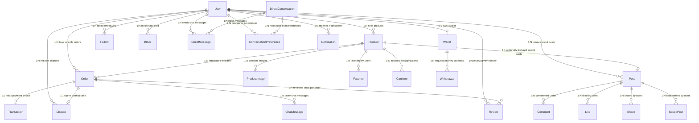
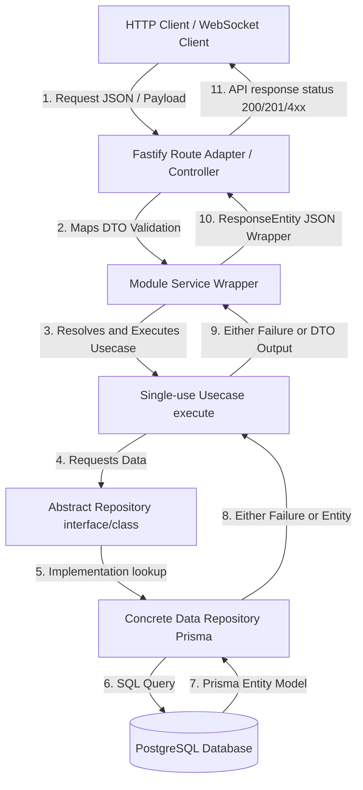

# AGENTS.md - FreeBay Development Guide

> Guidelines for agentic coding agents working on this repository

---

## Project Overview

FreeBay is a C2C hybrid marketplace platform (Instagram + Mercado Livre) with:
- **Backend:** TypeScript + NestJS + Prisma + PostgreSQL + Redis
- **Frontend:** Flutter (iOS/Android)

Features: social profiles, escrow payments, digital wallet, disputes, chat.

---

## 1. Build, Lint, and Test Commands

### Backend (NestJS)

**Location:** `nest-backend/`

| Command | Description |
|---------|-------------|
| `npm run start` | Run production server |
| `npm run start:dev` | Start dev server with watch mode |
| `npm run build` | Build the application |
| `npm run test` | Run all Jest tests |
| `npm run test:watch` | Run Jest in watch mode |

**Running a single test:**
```bash
# Run specific test file
npm test -- src/modules/auth/usecases/register.usecase.spec.ts

# Run specific test by name pattern
jest --testNamePattern "should return error" src/modules/auth/usecases/register.usecase.spec.ts
```

**Prisma commands:**
```bash
npm run prisma:generate   # Generate Prisma client
npm run prisma:migrate   # Run migrations
npm run prisma:studio   # Open database GUI
```

### Frontend (Flutter)

```bash
cd frontend
flutter pub get
flutter run                    # Run on connected device
flutter test                   # Run all tests
flutter test test/file_test.dart  # Run single test
flutter build apk --debug      # Build debug APK
flutter build apk --release    # Build release APK
```

---

## 2. Code Style Guidelines

### TypeScript (Backend)

**Strict Mode:** All code must pass strict TypeScript (`strict: true` in tsconfig.json).

**Path Aliases:** Use `@/` for imports from `src/` root:
```typescript
import { Either, left, right } from '@/shared/core/either';
import { AppError, NotFoundError } from '@/shared/core/errors';
```

### Error Handling Pattern

Use the **Either type** pattern for all use cases:
```typescript
import { Either, left, right, isLeft, isRight } from '@/shared/core/either';
import { AppError, NotFoundError } from '@/shared/core/errors';

async execute(input: Input): Promise<Either<AppError, Output>> {
    const entity = await this.repository.findById(input.id);
    if (!entity) {
        return left(new NotFoundError('Entity'));
    }
    return right({ entity });
}
```

**Error classes:** Extend `AppError` with code, message, statusCode:
```typescript
export class NotFoundError extends AppError {
    constructor(resource: string) {
        super('NOT_FOUND', `${resource} não encontrado(a)`, 404);
    }
}
```

### DTO Validation

Use **Zod** for input validation in DTOs:
```typescript
import { z } from 'zod';

export const registerSchema = z.object({
    email: z.string().email(),
    password: z.string().min(8),
    displayName: z.string().min(2).max(50),
});
```

### Prisma Types

Use **Prisma generated types** for input/output instead of custom interfaces:
```typescript
import { Prisma, User, Product, Order } from '@prisma/client';

// For create input - use Prisma types
type CreateUserInput = Prisma.UserCreateInput;
type UpdateUserInput = Prisma.UserUpdateInput;

// For responses - use mappers to convert Prisma models to API responses
```

### Clean Architecture

Follow **Clean Architecture** with vertical modules:
```
src/modules/{module}/
├── dtos/           # Zod validation schemas
├── mappers/        # Convert Prisma models → API responses
├── repositories/   # Concrete repository classes (no interfaces)
├── usecases/       # Business logic
└── controllers/    # HTTP endpoints
```

**Repository Pattern:** Use concrete classes, no interfaces:
```typescript
// Good - inject concrete repository
constructor(private userRepository: PrismaUserRepository) {}

// Bad - don't use interfaces
constructor(private userRepository: IUserRepository) {}
```

### Architecture Layers

Follow **Vertical Modules** architecture (same as Flutter `features/`):
```
src/
├── shared/                    # Reusable helpers
│   ├── core/                 # Either type, AppError classes
│   ├── infra/prisma/        # Prisma client
│   └── http/                # Response helpers, route-adapter
│
└── modules/                  # Vertical slices (one folder per feature)
    ├── auth/
    │   ├── dtos/            # Zod schemas
    │   ├── mappers/         # Prisma → API response mappers
    │   ├── repositories/    # Concrete repository classes
    │   ├── usecases/        # Business logic
    │   └── routes.ts        # Fastify routes
    ├── social/
    ├── products/
    └── ...
```

**Route Adapter Pattern** - No controllers needed:
```typescript
import { adaptRoute } from '@/shared/http/route-adapter';
import { registerSchema } from './dtos/auth.dto';
import { RegisterUseCase } from './usecases';

app.post('/register', adaptRoute(registerSchema, registerUseCase, { statusCode: 201 }));
```

**DI Pattern:** Repositories are instantiated in route files (`modules/*/routes.ts`) and injected into use cases via constructors. Use cases never instantiate infrastructure directly.

### Naming Conventions

| Element | Convention | Example |
|---------|------------|---------|
| Classes | PascalCase | `RegisterUseCase`, `AuthController` |
| Variables | camelCase | `userRepository`, `existingUser` |
| Files | kebab-case | `register.usecase.ts` |
| Tests | `.spec.ts` suffix | `register.usecase.spec.ts` |

### Testing Patterns

```typescript
describe('RegisterUseCase', () => {
    let sut: RegisterUseCase;

    beforeEach(() => {
        sut = new RegisterUseCase(mockUserRepository);
        jest.clearAllMocks();
    });

    it('should return error if email exists', async () => {
        // test implementation
    });
});
```

### Code Practices

- No comments in code (unless explaining complex business logic)
- Dependency injection via constructor — repos instantiated in route files, injected into use cases
- Use cases depend on concrete repositories (in same module), never on interfaces
- All monetary values in **cents (Int)** — never Float
- Use soft delete for sensitive data
- Use Zod schemas for all input validation (no inline validation in routes)
- Use route adapter pattern to eliminate boilerplate

---

## 3. Flutter Best Practices

### Import Style

- **ALWAYS use absolute imports** with `package:freebay/` prefix
- **NEVER use relative imports** (`../` or `./`)
- Correct: `import 'package:freebay/core/theme/app_colors.dart';`
- Wrong: `import '../../core/theme/app_colors.dart';`

### DO

- Use widgets for every UI element
- Implement proper state management (Riverpod or GetX recommended)
- Use const constructors where possible
- Dispose resources in state lifecycle
- Test on multiple device sizes
- Use meaningful widget names
- Implement error handling
- Use responsive design patterns
- Test on both iOS and Android
- Document custom widgets

### DON'T

- Build entire screens in build() method
- Use setState for complex state logic
- Make network calls in build()
- Ignore platform differences
- Create overly nested widget trees
- Hardcode strings (use constants/theme)
- Ignore performance warnings
- Skip testing
- Forget to handle edge cases
- Deploy without thorough testing

---

## 4. Design System (Frontend)

### Color Palette

| Color | Hex | Usage |
|-------|-----|-------|
| Primary Magenta | `#8A1083` | Brand, CTAs, headers — used sparingly ("a laser, not a paint bucket") |
| Gradient (buttons) | `#660062 → #8A1083` | Signature CTA gradient |
| Surface hierarchy | `#F9F9F9 → #F3F3F3 → #EEEEEE → #E2E2E2` | Tonal depth (no shadows) |
| Dark Gray | `#1F2937` | Text, dark backgrounds |

See `freebay-design-system` skill for the full "Digital Brutalist" rules (0px radius, no shadows, Space Grotesk + Inter).

**Dark Mode:** Required. Implement dark theme variant of all colors.

### Flutter Architecture

```
lib/
├── core/
│   ├── theme/           # Colors, typography, spacing, dark mode
│   ├── components/      # Design System primitives (see below)
```

### Design System Primitives (Use First!)

Before implementing any UI pattern, check if a primitive exists in `lib/core/components/`:

| Pattern | Primitive |
|---------|-----------|
| Container with 2px onSurface border | `BrutalistBox` |
| Filter/segment chip | `BrutalistFilterChip` |
| Bottom sheet | `showBrutalistSheet()` |
| Empty/error state | `EmptyState` |
| Section heading ("FEED") | `SectionTitle` |
| Menu list item | `MenuListTile` |
| Stats column | `StatColumn` |

**DO NOT inline these patterns.** If a variant is needed, extend the primitive, don't copy-paste.
│   └── router/         # go_router configuration
├── features/
│   ├── auth/           # Login, register
│   ├── social/         # Feed, posts, likes, comments
│   ├── product/       # Listings, search, details
│   ├── checkout/      # Payments, escrow status
│   ├── wallet/        # Balance, transactions, withdrawals
│   ├── chat/          # Messaging
│   ├── dispute/       # Dispute handling
│   └── profile/       # User profiles, reputation
└── shared/
    ├── services/      # HTTP, storage, token service
    └── errors/       # Failures, exceptions
```

### Key Components to Build

- `AppButton` - Primary, Secondary, Ghost, Danger (radius 12px)
- `AppTextField` - Input with inline validation
- `AppCard` - Product card with image, price, reputation
- `UserAvatar` - Sizes: 32, 48, 80px with verification badge
- `ReputationStars` - 1-5 stars with count
- `EscrowStatus` - Payment timeline (Pending → Held → Released)
- `WalletCard` - Balance display with pending/available
- `SocialPost` - Feed post with like, comment, share
- `BannerCarousel` - Image carousel with dots
- `AppBottomSheet` - Modal actions

---

## 5. Database & System Architecture

### Prisma Schema & Relationships
The database is structured on PostgreSQL using Prisma ORM. Below is the systematic mapping of all core database models and their relational dependencies:



### Core Domain Subsystems
1. **User & Authentication:** Manages profiles, follower graphs (`Follow`), and social blocklists (`Block`).
2. **Escrow Marketplace (Product & Order):** Core purchasing flow. Money goes to escrow (`EscrowStatus = HELD`) and release to seller occurs only when delivery is confirmed (`OrderStatus = DELIVERED`, escrow release).
3. **Financial Wallet (Wallet & Withdrawal):** Tracks `availableBalance`, `pendingBalance` (funds held in escrow), and withdrawal requests.
4. **Conflict Resolution (Dispute):** Handles client-to-client transaction arguments within a strict 48-hour delivery window.
5. **Real-time Messaging (DirectConversation & Order Chat):** Real-time chats mapped individually with customizable styling preferences per user.

---

## 6. Clean Architecture Flow & Fluxgram

We adhere to vertical modules using strict unidirectional dependency flows. High-level execution flow for any API endpoint is structured as:



### Dependency Rules
* **Controllers** must ONLY inject the module's main **Service**.
* **Services** must ONLY inject **Usecases**.
* **Usecases** must ONLY inject **Abstract Repositories** (no PrismaService injections).
* **Concrete Repositories** implement abstract contracts and inject **PrismaService** to run queries.

---

## 7. API Response Format

**Success:**
```typescript
{ "success": true, "data": { ... } }
```

**Error:**
```typescript
{ "success": false, "error": { "code": "ERROR_CODE", "message": "..." } }
```

---

## 8. Important Notes

- JWT tokens: 15 min access, 7 days refresh
- Validate webhook signatures from payment providers
- Use idempotency keys for payment requests
- All split calculations happen server-side
- Prices always in cents (Int)

