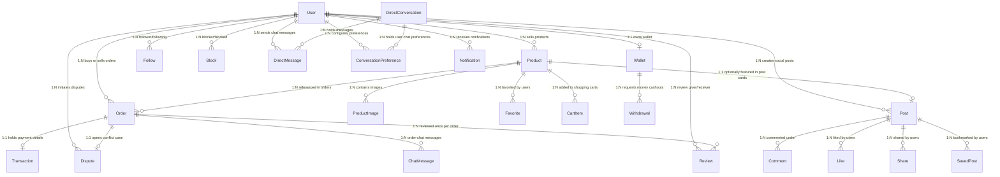
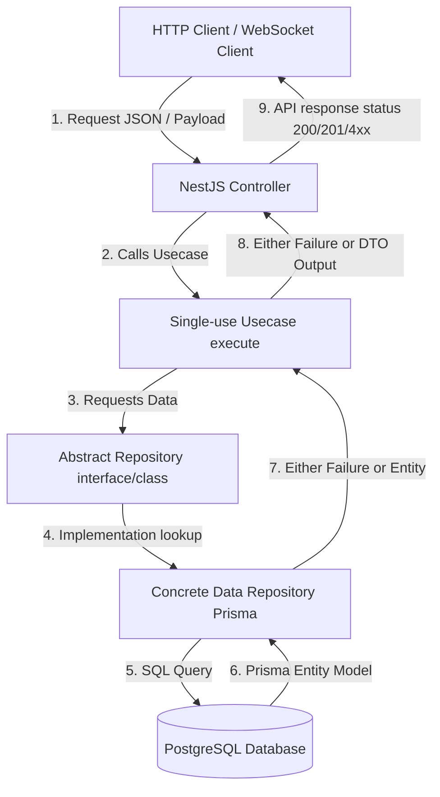

# AGENTS.md - FreeBay Architecture Diagrams

> For conventions and current architecture rules, see [CLAUDE.md](./CLAUDE.md). This file only diagrams the schema and request-flow shape.

---

## Database Schema

The database is structured on PostgreSQL using Prisma ORM. Below is the systematic mapping of all core database models and their relational dependencies:

## Request Flow

High-level execution flow for any API endpoint:

