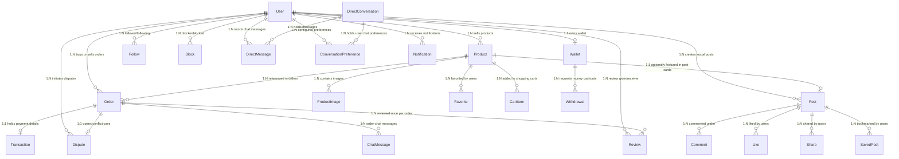
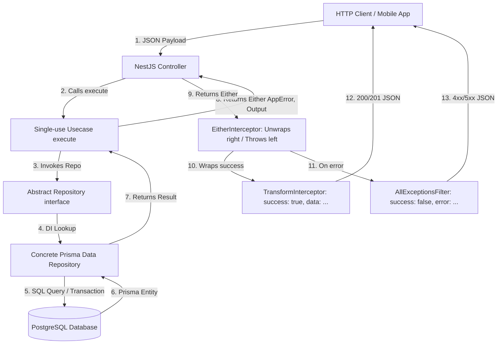

# AGENTS.md - FreeBay Architecture & Agent Directives

> **MANDATORY DIRECTIVE FOR ALL AI AGENTS & ASSISTANTS**:
> You MUST explicitly review, follow, and adhere to the architectural skills located in [`.agents/skills/`](./.agents/skills/) (and mirrored in [`.claude/skills/`](./.claude/skills/)) when reading, scaffolding, refactoring, or extending any part of FreeBay.

---

## 📚 FreeBay Agent Skills Directory

All agents must follow the conventions defined in the corresponding skill before writing or modifying code:

| Skill Name | Target Stack & Scope | Location |
|---|---|---|
| **[`freebay-app-flows`](./.agents/skills/freebay-app-flows/SKILL.md)** | End-to-end user journeys, sequence flows, state hierarchy, and navigation routes (Auth, Biometry, Google Login, Onboarding, Wallet, Chat, Profile, Feed/Explore, Checkout, Disputes, Notifications). | [`.agents/skills/freebay-app-flows/SKILL.md`](./.agents/skills/freebay-app-flows/SKILL.md) |
| **[`freebay-design-system`](./.agents/skills/freebay-design-system/SKILL.md)** | Flutter "Digital Brutalist" UI: strict 0px border radius, no drop shadows (tonal layering only), no divider lines, Space Grotesk / Inter fonts, `#8A1083` magenta accent, 150ms linear micro-animations, dark mode tokens, and widget primitives. | [`.agents/skills/freebay-design-system/SKILL.md`](./.agents/skills/freebay-design-system/SKILL.md) |
| **[`freebay-flutter-feature`](./.agents/skills/freebay-flutter-feature/SKILL.md)** | Frontend Flutter Clean Architecture: `data/domain/presentation` layers, Riverpod state management, Dio HTTP client, `safeCall` error wrapper, GoRouter route definitions, and widget tests. | [`.agents/skills/freebay-flutter-feature/SKILL.md`](./.agents/skills/freebay-flutter-feature/SKILL.md) |
| **[`freebay-backend-module`](./.agents/skills/freebay-backend-module/SKILL.md)** | NestJS Backend vertical slices: `dtos/` with `class-validator` + `@ApiDoc`, single-class `usecases/` returning `Either<AppError, Output>`, `domain/repositories/` abstract interfaces, `data/repositories/` concrete Prisma repos, mappers, and colocated `*.spec.ts` tests. | [`.agents/skills/freebay-backend-module/SKILL.md`](./.agents/skills/freebay-backend-module/SKILL.md) |
| **[`freebay-data-model`](./.agents/skills/freebay-data-model/SKILL.md)** | PostgreSQL / Prisma schema conventions: strict monetary **cents-as-Int** (`price Int // em centavos`), real enums over strings, mandatory `onDelete` cascading rules, foreign key indexing, and migration workflows. | [`.agents/skills/freebay-data-model/SKILL.md`](./.agents/skills/freebay-data-model/SKILL.md) |
| **[`freebay-system-design`](./.agents/skills/freebay-system-design/SKILL.md)** | End-to-end system design: C2C escrow lifecycle, Socket.IO `/chat` gateway, Stripe PaymentSheet & Checkout Sessions, Redis token blacklist, background cron tasks, and security isolation. | [`.agents/skills/freebay-system-design/SKILL.md`](./.agents/skills/freebay-system-design/SKILL.md) |

---

## 🗄️ Database Schema & Relational Mapping

The database runs on PostgreSQL using Prisma ORM. Below is the systematic mapping of all core database models and their relational dependencies:



---

## ⚡ High-Level API Request Flow (Either Monad & Interceptor Pipeline)



---

## 💳 Payment & Escrow Lifecycle (Stripe)

```mermaid
graph TD
    Client[Flutter Mobile / Web] -->|1. POST /payments/payment-intent/:orderId (Mobile) OR /checkout/:orderId (Web)| Controller[NestJS PaymentsController]
    Controller -->|2. Invokes| Usecase[CreatePaymentIntentUseCase / CreatePaymentSessionUseCase]
    Usecase -->|3. Requests Session/Secret| Provider[StripeProvider]
    Provider -->|4. API Call| Stripe[Stripe API]
    Stripe -->|5. clientSecret / checkoutUrl| Provider
    Provider -->|6. Saves Transaction PENDING| Repo[TransactionDatabaseRepository]
    Repo -->|7. Prisma Insert| DB[(PostgreSQL)]
    Usecase -->|8. Returns credentials| Client
    Client -->|9. Native PaymentSheet OR Web Checkout| Stripe
    Stripe -->|10. Webhook: payment_intent.succeeded / checkout.session.completed| Guard[WebhookGuard & DedupeInterceptor]
    Guard -->|11. Validated Event| WebhookUC[ProcessWebhookUseCase]
    WebhookUC -->|12. Transaction PAID + Escrow HELD + Order CONFIRMED| DB
    WebhookUC -->|13. Push Notifications| Notif[NotificationService]
```

---

## 🔒 Non-Negotiable Architecture Invariants

1. **Zero Linter Warnings & Continuous Integration**:
   - Backend: Must pass `npx tsc --noEmit` and `npm test` with zero failures.
   - Frontend: Must pass `flutter analyze` with 0 warnings, 0 infos, 0 errors, and all tests in `flutter test` passing.
   - CI Pipeline: All PRs must pass the GitHub Actions workflow (`.github/workflows/ci.yml`) including PostgreSQL & Redis service tests.
2. **Cents as Integers**: All monetary amounts must be stored as integers representing cents in both Prisma and Dart (`1990` = R$ 19,90).
3. **No Unhandled Throws**: Business failures in use cases must return `left(new AppError(...))` or `Left(Failure(...))`. Never throw raw unhandled exceptions.
4. **Prisma Payload Typing**: Database repository returns and mappers must use `Prisma.validator<...>()` to derive strict `Prisma.*GetPayload` types. Avoid untyped `as unknown as` assertions.
5. **Privacy Crypto Escrow**: Untrackable payments must adhere to the `CryptoPaymentProvider` contract (Monero XMR via `monero-wallet-rpc` ephemeral subaddresses and atomic piconero tracking).
6. **Digital Brutalist Aesthetics**: Never add `BorderRadius.circular()`, blurred drop shadows, or standard `Divider()` widgets to the Flutter UI.

