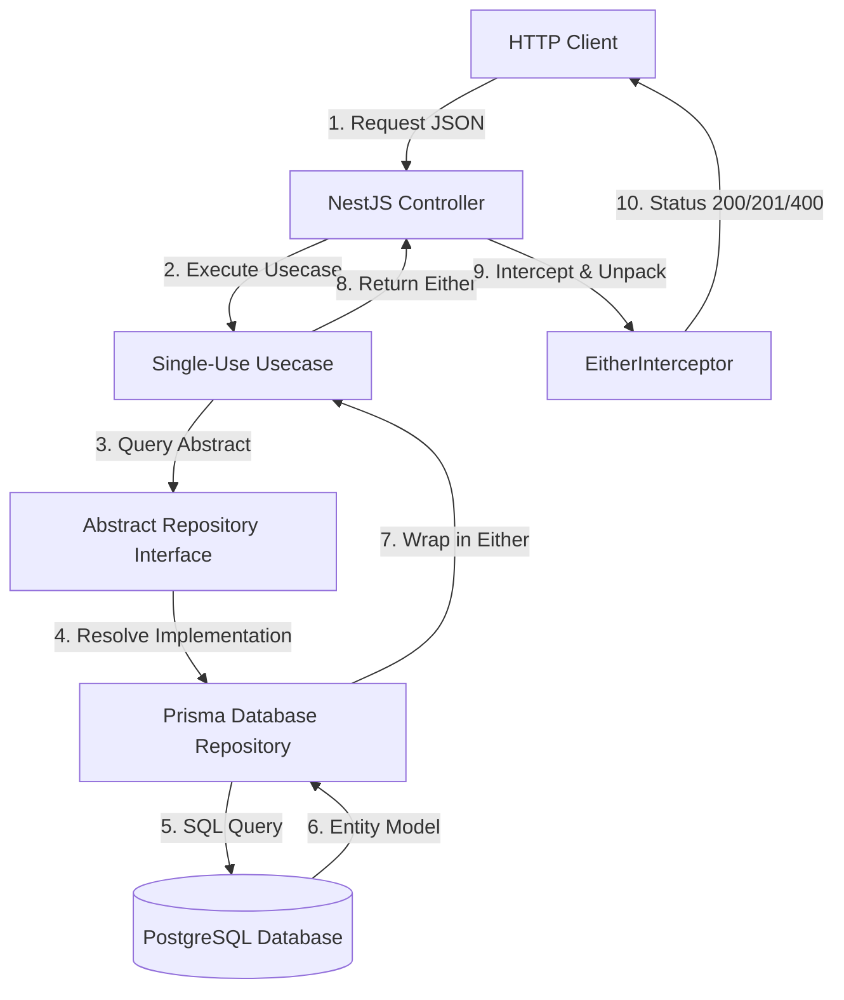
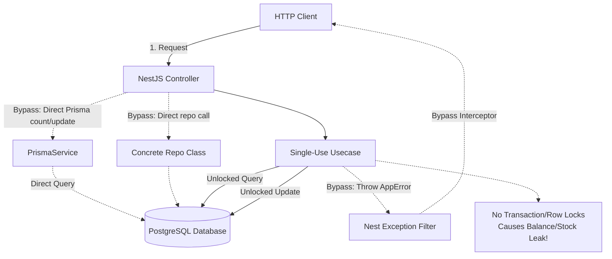

# Codebase Audit Overview

This document provides a high-level executive summary, scope, and index of findings for the security, performance, and architectural audit of the FreeBay backend.

---

## Executive Summary

A comprehensive architectural and security audit of the FreeBay backend (NestJS/Prisma/PostgreSQL) was conducted. The audit revealed critical architectural deviations, financial leaks in the transaction/escrow systems, severe race conditions in stock management and withdrawals, and security guard gaps that expose private endpoints to unauthenticated or guest users.

**Key Findings:**
1. **Financial Balance Leaks:** Cancellation and dispute resolutions fail to decrement the seller's `pendingBalance` when refunding the buyer, leading to infinite money creation/floating balances.
2. **Race Conditions:** Lack of locking (e.g., `SELECT FOR UPDATE` or transactional locks) allows double-withdrawals and product overselling under concurrent request loads.
3. **Guard Gaps:** Private operations like viewing stories, updating FCM tokens, opening disputes, and sending chat messages are open to unauthenticated sessions or guest accounts due to missing guards (`NonGuestGuard`, `JwtAuthGuard`).
4. **Architectural Deviations:** Controllers are directly injecting `PrismaService` and bypass Use Cases, while Services manually throw exceptions rather than returning `Either` values, rendering the `EitherInterceptor` useless.

---

## Audit Scope

The audit covered the entire NestJS codebase located under `nest-backend/src/modules/`, with a focus on the following modules:
- **Auth & Users:** Authentication, profile editing, followers, and blocks.
- **Wallet & Payments:** Balance management, deposits, PIX creation, and withdrawals.
- **Cart & Orders:** Cart checkout, order state machine, and escrow.
- **Disputes:** Dispute resolution flow and cron cleanup tasks.
- **Social & Stories:** Feed generation, comments, story views, and indexing.

---

## Summary of Findings

| ID | Module | Title | Priority | Status | Description |
| :--- | :--- | :--- | :--- | :--- | :--- |
| **ARC-01** | Architecture | Controller Direct Prisma Injection | High | To Refactor | `UsersController` directly queries the database via `PrismaService`, bypassing the repository and usecase layers. |
| **ARC-02** | Architecture | Use Case Bypass | Medium | To Refactor | Follow/Block endpoints in `UsersController` query repositories directly, bypassing Use Cases. |
| **ARC-03** | Architecture | Dependency Inversion Violation | Medium | To Refactor | Use Cases inject concrete Prisma repositories (e.g., `PrismaOrderRepository`) instead of abstract repository interfaces. |
| **ARC-04** | Architecture | Nested `api/` Folders | Low | To Refactor | Deeply nested `api/` folders exist in Auth, Chat, Products, and Reviews modules. |
| **ARC-05** | Architecture | EitherInterceptor Bypass | High | To Refactor | `AuthService` and `CategoryService` throw errors manually instead of returning `Either` types. |
| **ARC-06** | Architecture | Mutable Response DTOs | Low | To Refactor | DTOs like `AuthSessionResponse` and `UserResponse` are missing `readonly` modifiers. |
| **ARC-07** | Architecture | Missing Mapper Directories | Low | To Refactor | Social, Stories, and Category modules lack structured mapping directories. |
| **SEC-01** | Security / Leaks | Dangling Escrow on Cancel | Critical | To Refactor | Seller `pendingBalance` is not decremented when an order is cancelled and the buyer is refunded. |
| **SEC-02** | Security / Leaks | Unreclaimed Escrow on Dispute Win | Critical | To Refactor | Seller `pendingBalance` is not decremented when a buyer wins a dispute, creating money leaks. |
| **SEC-03** | Security / Leaks | Double-Withdrawal Race Condition | Critical | To Refactor | `WithdrawUseCase` checks balance in memory without row locking, allowing concurrent balance bypass. |
| **SEC-04** | Security / Leaks | Product Stock Overselling | High | To Refactor | Product stock checks lack pessimistic locks (`SELECT FOR UPDATE`), allowing stock overselling. |
| **SEC-05** | Security / Leaks | Blind Cron State Changes | High | To Refactor | Cron tasks for escrow release and dispute resolution update states blindly without locking or verification. |
| **SEC-06** | Security / Leaks | Non-Atomic Cart Checkout | High | To Refactor | Checkout loop creates PIX payments sequentially without transaction atomicity, leading to partial checkouts. |
| **SEC-07** | Security / Leaks | Story View Database Crash | Medium | To Refactor | `/stories/:id/view` is missing `JwtAuthGuard`, causing foreign key crashes when guest sessions view stories. |
| **SEC-08** | Security / Leaks | Guest Account Guard Gaps | High | To Refactor | Chat, Reports, Disputes, and FCM token updates are exposed to Guest accounts due to missing `NonGuestGuard`. |
| **SEC-09** | Security / Leaks | Broken Optional Auth | Medium | To Refactor | Explore feed ignores auth headers, preventing authenticated explore feeds. |
| **SEC-10** | Security / Leaks | Masked CPF and Role Leak | High | To Refactor | Public profile endpoint uses a mapper that leaks masked CPF and role to unauthenticated users. |
| **PER-01** | Performance | N+1 Loops in Cron Tasks | High | To Refactor | Cron tasks loop through databases sequentially to update escrows and disputes. |
| **PER-02** | Performance | Comments N+1 & In-Memory Tree | High | To Refactor | `findAllByPostId` loads all comments into memory to build comment tree pagination, causing server strain. |
| **PER-03** | Performance | Unindexed Queries | High | To Refactor | Critical queries filter/sort by unindexed fields (`Post.createdAt`, `Story.expiresAt`, `Follow.followingId`). |
| **PER-04** | Performance | Global Stories Feed Pagination | Medium | To Refactor | Global stories feed loads all active stories into memory without database-level pagination. |
| **PER-05** | Performance | Missing Redis Caching Layers | Medium | To Refactor | Frequently accessed items (categories, public profiles, feeds) fetch from PostgreSQL on every request. |
| **SMP-01** | Simplification | Multiple Use Cases in Single File | Low | To Refactor | Use Cases in Wallet, Payments, and Notifications are grouped in single files. |
| **SMP-02** | Simplification | Stateful Gateway & Services | High | To Refactor | Gateway connections and image caches are stored in memory maps, breaking horizontal scaling. |
| **SMP-03** | Simplification | Ignored Search Filters | Medium | To Refactor | `searchPosts` completely ignores user-provided following/followers filters. |
| **SMP-04** | Simplification | Broken Suggestions Query Logic | High | To Refactor | Suggestions query contains contradictory logic that always returns empty suggestions. |

---

## Architectural Request/Response Flows

### 1. Correct Clean Flow (Domain-Driven Design)

In the standard architecture, requests flow cleanly from Controller to Use Case to Abstract Repository, where failures are wrapped as `Left(AppError)` and successes as `Right(Data)`. The `EitherInterceptor` automatically handles mapping these to clean HTTP responses.

### 2. Broken Deviated Flows (Identified Leaks & Bypasses)

The audit identified multiple paths that deviate from this structure:
- **Usecase Bypass:** Controller directly communicates with the concrete repository (e.g., `FollowRepository` or `BlockRepository`).
- **Prisma Injection Bypass:** Controller directly calls `PrismaService` to query counters or update user records.
- **Exception Throwing Bypass:** Use Case or Service manually throws an exception, bypassing the `EitherInterceptor` and disrupting telemetry.
- **Race Condition / Lack of Lock:** Use Case queries balance/stock, checks condition in memory, and writes update without database-level locking.

